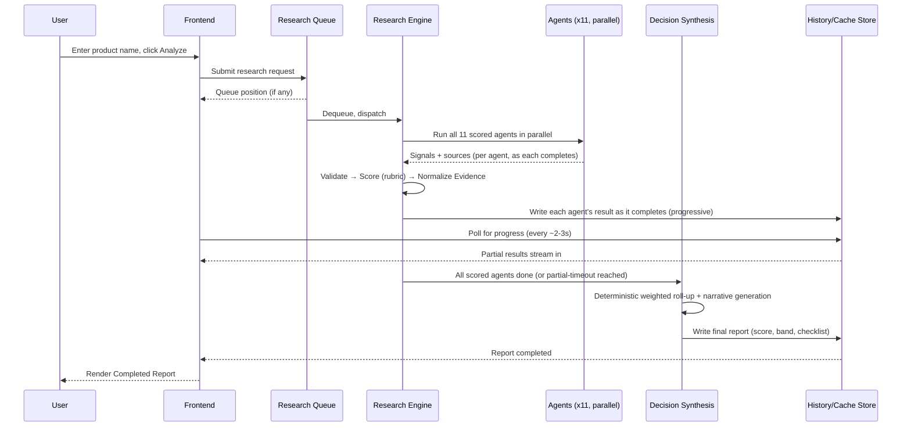

# EcomOS AI — Functional Blueprint (FBP v1.0)

**Status:** DRAFT — product design only. No code, no APIs, no schemas, no components in this document.
**Audience:** An engineering team that already has the SRS (v0.2) and needs zero further product questions to build.
**Author role for this document:** Senior Product Manager / Principal UX Architect / AI System Designer.

This document defines *behavior*, not implementation. Every screen, workflow, and state below is designed against the same backend concepts already fixed in the SRS (12 agents, Confidence Score, Evidence Score, deterministic rubric scoring, anonymous sessions, prompt versioning, caching, connectors) — this document does not re-derive those, it defines how a human experiences them.

---

## 1. Product Vision

**Why this exists.** An Indian ecommerce seller deciding whether to launch "Drawer Organizer" today does their research across a dozen open browser tabs — Amazon listings, Flipkart, IndiaMART, a review page, a GST calculator, a notes app — and then makes a ₹20k–5L bet on a synthesis that lives only in their head. There is no record of *why* they decided, no way to compare that decision's reasoning against the next one, and no way to tell, six months later, whether their gut feel was well-calibrated. That is the long-term problem EcomOS AI solves: it turns fragmented, one-off, unaccountable product research into a structured, accumulating, auditable **operating system of record** for every product decision a seller ever makes.

**Who it helps.** Primary: beginner-to-intermediate Indian Amazon/Flipkart/Meesho sellers with a ₹20k–5L testing budget, for whom a wrong launch is a real financial setback, not a rounding error. Secondary (post-MVP): sourcing agencies, small brand aggregators, and consultants who research on behalf of multiple sellers and need a shared, auditable record across clients.

**How it differs from Helium10 / JungleScout.** Those tools are **data terminals**: they hand you keyword volume tables, sales-estimate charts, and PPC dashboards, and expect *you* to synthesize a decision. They are also built for the US/global Amazon seller — no rupee profit math, no RTO risk modeling, no GST/BIS compliance flagging, no IndiaMART/TradeIndia sourcing. EcomOS AI is the inverse: it is a **decision engine**, not a data terminal. It ingests the same category of raw signal but returns a synthesized, evidence-scored, auditable recommendation — Launch / Test First / Reject — with the underlying data available on demand, not as the primary interface. It is India-first by construction, not by translation.

**How it differs from a generic AI chatbot** (ChatGPT/Perplexity asked to "research this product for me"). A chatbot gives you an unscored, unversioned wall of prose that you cannot compare across products, cannot audit six months later, and that forgets everything the moment the session ends. EcomOS AI is **stateful** (every run is a permanent record), **structured** (every claim carries a Confidence Score and Evidence Score), **deterministic where it matters** (the number that drives your Launch/Reject decision is never something an LLM freely invented), and **comparable** (Compare Mode, §9) in a way a chat transcript can never be.

**The long-term problem this solves.** Not "how do I get an AI summary of a product" — that is commodity. The actual problem is **decision fatigue and unaccountable research** in a domain where each decision has real, hard-to-reverse financial consequences. EcomOS AI's job is to make every product decision fast to make, easy to explain to someone else, and possible to learn from later.

---

## 2. Product Principles

These are the non-negotiable philosophy statements every screen and workflow in this document is designed against. When a future feature request conflicts with one of these, the principle wins.

1. **Never fake certainty.** If the system doesn't know, it says so — visibly, not in fine print. No score is ever presented as more certain than its underlying evidence supports.
2. **Evidence over eloquence.** A well-written, confident paragraph is worth nothing without a source behind it. Evidence Score is never subordinate to how convincing the reasoning text sounds.
3. **Humans make the final decision.** The system recommends; it never auto-executes. Launch/Test/Reject is always a deliberate human click, and manual verification (§12) exists specifically to keep a human in the loop before any capital is committed.
4. **Transparent scoring.** Every number on screen must be traceable, on demand, to the inputs that produced it. No "black box 82."
5. **Explainable by default.** Every score ships with a one-line "why," not just a value. If a user has to ask "why is this 82?", the design has failed.
6. **Fast over fancy.** Anything that doesn't require an AI call responds instantly. No spinner theater, no decorative animation, no artificial delay to "feel more thorough."
7. **Data first, opinions second.** Structured signals are shown before prose narrative. The system's own confidence in its opinion is always visible next to the opinion.
8. **Consistency over novelty.** One interaction pattern, reused everywhere. A user who learns how an AgentCard works on the Demand section already knows how it works on Compliance.
9. **Progressive disclosure.** Summary first, depth on demand. Nothing forces a user through a wall of text before reaching the conclusion.
10. **Auditability as a feature, not an afterthought.** Every report is a permanent, versioned artifact. Nothing about a past decision is ever silently rewritten.
11. **Reduce decision fatigue, don't just add data.** The system's job is to narrow the decision (Launch/Test/Reject), not to hand the user more raw material to weigh alone.

---

## 3. Product Navigation

### 3.1 Top-level structure (persistent sidebar, Linear/Notion-style)

```
EcomOS AI
├── Dashboard                 (home)
├── Research                  (new research + active/queued runs)
├── History                   (all past research runs, all products)
├── Compare                   (multi-product comparison)
├── Suppliers                 (supplier catalog, cross-product)
├── Reports                   (saved / exported reports)
├── Methodology                (read-only transparency: agent versions, how scoring works)
├── ───────────────────────
├── Future Modules  [disabled] (Inventory · Orders · Advertising · Keyword Tracking ·
│                                Profit Tracking · Brand Health · Pricing Alerts ·
│                                Sales Dashboard · AI Automation)
└── Settings
```

Note on "Prompt Library": the SRS's DB-backed prompt versioning is an engineering concern. The user-facing surface for it is **Methodology** — a read-only transparency screen (which agent version produced a given report, what changed between versions), not a prompt-authoring tool. Editing prompts is an internal/admin capability, out of scope for the seller-facing product entirely.

### 3.2 Navigation hierarchy

```
Primary   → Sidebar (Dashboard / Research / History / Compare / Suppliers / Reports / Methodology / Settings)
Secondary → In-page tabs within a Report (Overview / Demand / Competition / ... / Financials / Risks)
Tertiary  → Inline expand/collapse (an AgentCard's "Why this score?" / "Sources" detail)
```

### 3.3 Navigation rules

- Sidebar is always visible on desktop (≥1024px); collapses to a bottom tab bar (Dashboard / Research / History / Compare / More) on mobile.
- The active section is always highlighted; nested screens (e.g., Compare → viewing Product A vs B) show a breadcrumb back to the parent list.
- **A research run in progress persists a small status pill in the top bar regardless of which screen the user navigates to.** This is a hard rule, not a nicety — it is what makes "browse History while your research finishes" and "resume interrupted research" (§5, Journey J7) actually work as an experience rather than a hope.
- "Future Modules" entries are always visible but disabled with a "Coming Soon" tooltip — never hidden. Users should always be able to see where the product is going, per Linear/Notion convention, and it sets expectations rather than surprising users with silence.

### 3.4 Navigation states

| State | Meaning |
|---|---|
| Default | Unselected sidebar item |
| Active | Current section, persistent highlight |
| Disabled | Future Modules — visible, non-interactive, tooltip on hover |
| Badge (count) | e.g., "Research (2)" when 2 runs are active/queued |
| Notification dot | e.g., History has a report that just flipped to "outdated" |

---

## 4. Screen Inventory

Every screen, with Purpose / Primary Actions / Secondary Actions / Widgets / Information Displayed / Future Expansion.

### 4.1 Landing (first-ever visit, no session history)

- **Purpose:** Get a brand-new anonymous user to their first Analyze click in under 10 seconds — no signup wall, no explanation screen in the way.
- **Primary actions:** Enter a product name → Analyze.
- **Secondary actions:** View 2–3 example product names ("Try: Drawer Organizer, Yoga Mat"); scroll to a one-screen explainer of what the system does.
- **Widgets:** Analyze input box, example-chip row, minimal "How it works" 3-step strip (Enter product → 12 agents analyze → Get a scored decision).
- **Information displayed:** No history yet (this *is* the empty state for Dashboard, functionally).
- **Future expansion:** Category-specific landing variants (e.g., a "Kitchen sellers" entry point) once acquisition channels justify it.

### 4.2 Dashboard (returning session, has history)

- **Purpose:** One-glance orientation — what's running, what needs attention, what to do next.
- **Primary actions:** Start new research (Analyze box, always present); resume any in-progress run.
- **Secondary actions:** Jump to a favorited report; jump to a report needing manual verification; jump to History/Compare/Suppliers.
- **Widgets:** Analyze box; "Active Research" strip (running/queued runs with live progress); "Needs Your Attention" strip (Needs Review lifecycle state, weak-evidence reports, outdated reports); Favorited Reports grid; Recent Searches chips.
- **Information displayed:** Session-scoped only (no cross-session/global data, per anonymous model).
- **Future expansion:** Category benchmark widgets, a "decision journal" streak/summary once that feature ships (§21 opportunities).

### 4.3 New Research

- **Purpose:** Capture a product name and (optionally) enough context to seed a better run.
- **Primary actions:** Enter product name → Analyze.
- **Secondary actions:** Optional category hint (helps Compliance/Demand agents); "Add to Research Queue" instead of running immediately, if the user wants to batch a few ideas back-to-back.
- **Widgets:** Input field with inline validation; optional category dropdown; queue-position preview if a run is already active.
- **Information displayed:** Estimated time to first result, based on historical median (§15).
- **Future expansion:** CSV batch upload for multi-product research (§21 opportunities).

### 4.4 Research Progress

- **Purpose:** Make waiting feel productive and transparent — show exactly what's happening, not a generic spinner.
- **Primary actions:** None required (passive watch); Cancel.
- **Secondary actions:** Retry an individual failed agent; navigate away (progress persists via the top-bar pill, §3.3).
- **Widgets:** 12-agent checklist with per-agent status icon; overall progress bar; estimated remaining time; queue position (if applicable); Cancel button.
- **Information displayed:** Live status per agent (pending/running/completed/failed); completed agents' summaries reveal progressively, not all-at-once.
- **Future expansion:** Live partial-score preview once ≥6 agents complete (a directional score before all 12 finish) — deferred in MVP to avoid presenting a number that then visibly changes (tension with "never fake certainty").

### 4.5 Completed Report

- **Purpose:** The core artifact of the product — a single, scannable, auditable decision record.
- **Primary actions:** Save; Download PDF; Re-run recommendation (after editing Profit Calculator); Mark lifecycle state (Approve/Test/Reject).
- **Secondary actions:** Add to Compare; Add tag; Add to Favorites; Add a manual verification note; view Methodology for this specific run.
- **Widgets:** Score gauge; Risk badge; Recommendation banner; 11 AgentCards (expand/collapse); Profit Calculator (editable); Manual Verification Checklist; Sources/evidence panel per agent.
- **Information displayed:** Full report layout per §8.
- **Future expansion:** Scoped "Ask about this report" Q&A (§21 opportunities).

### 4.6 Compare Products

- **Purpose:** Force a side-by-side, apples-to-apples decision between 2–5 candidate products.
- **Primary actions:** Select products from History to compare; view winner recommendation.
- **Secondary actions:** Pin up to 3 for full detail in 5-product mode; remove a product from comparison; export comparison table.
- **Widgets:** Side-by-side score/dimension table; conflict/tie callouts; version-mismatch warning banner.
- **Information displayed:** Per §9.
- **Future expansion:** CSV/Excel export (§21 opportunities).

### 4.7 Supplier View

- **Purpose:** A cross-product catalog of every supplier lead the system (or the user) has ever surfaced, so leads are reusable, not buried inside one report.
- **Primary actions:** View supplier detail; mark verification status (contacted/sample ordered/verified).
- **Secondary actions:** Manually add a supplier lead; filter by product, location, verification status.
- **Widgets:** Supplier list/table; supplier detail card (source, MOQ, price range, location, sample availability, verification status, linked products).
- **Information displayed:** Always visibly labeled "Manual verification required" per supplier (carried from SRS).
- **Future expansion:** User-submitted outcome feedback ("sample matched description: yes/no") feeding back into supplier trust signals.

### 4.8 History

- **Purpose:** The full, permanent timeline of every research run — the "operating system of record."
- **Primary actions:** Open a past report; filter/search; re-run a product.
- **Secondary actions:** Tag; favorite; archive; compare selected.
- **Widgets:** Reverse-chronological timeline grouped by day/week; filter bar (recommendation band, score range, tag, date range, "needs manual verification"); search box; per-product "view score trend over time" expandable thread.
- **Information displayed:** Per §10.
- **Future expansion:** Team-shared history once accounts exist.

### 4.9 Methodology (transparency screen)

- **Purpose:** Let a curious or skeptical user see *how* the system reasons, without exposing a prompt-editing tool.
- **Primary actions:** View which agent versions produced a given report; view a plain-language description of each agent's role.
- **Secondary actions:** View the deterministic scoring weight table (§6 of the SRS, presented in plain language here).
- **Widgets:** Agent roster list (12 agents, one-line purpose each); version history per agent (what changed, when — no raw prompt text shown); scoring weight table.
- **Information displayed:** No raw prompts, no internal implementation detail — plain-language "what this agent looks at" and "how much it counts."
- **Future expansion:** Public-facing methodology page for marketing/trust purposes.

### 4.10 Settings

- **Purpose:** The minimum controls an anonymous-session product needs.
- **Primary actions:** Toggle dark/light mode; clear local session data (explicit, confirmed action).
- **Secondary actions:** View data retention policy; export all session data (portability, given no accounts exist to "recover" from).
- **Widgets:** Theme toggle; data/privacy panel; session export button.
- **Information displayed:** Session creation date, retention window countdown (per SRS NFR-13).
- **Future expansion:** Account creation/upgrade entry point, plan/billing once accounts exist.

### 4.11 Error State (generic screen-level treatment)

- **Purpose:** Never leave a user looking at a blank page or a stack trace.
- **Primary actions:** Retry; go back to Dashboard.
- **Secondary actions:** View what specifically failed (agent-level detail, not raw error).
- **Widgets:** Friendly illustration/icon + message + retry button. Full catalog in §13.

### 4.12 Loading State (generic component)

- **Purpose:** Distinguish "waiting on AI" from "waiting on nothing" (instant operations never show a spinner — Principle 6, §2).
- **Widgets:** Skeleton screens for layout-shaped waits (<2s expected); explicit progress checklist for AI waits (Research Progress, §4.4). Full detail in §15.

### 4.13 Empty State (generic component)

- **Purpose:** Every empty list is an invitation, never a dead end. Full catalog in §14.

### 4.14 Export / PDF Preview

- **Purpose:** Let a user confirm what a PDF will look like before downloading/sharing it externally.
- **Primary actions:** Download; (future) Share link.
- **Secondary actions:** Choose sections to include/exclude from the export.
- **Widgets:** Paginated preview matching the print-adapted report layout (§8.5).
- **Information displayed:** Same data as the Completed Report screen, reflowed for print pagination.
- **Future expansion:** Branded/white-label export for agency users.

---

## 5. User Journeys

Each journey includes its decision branches — not just the happy path.

### J1 — Research first product

1. Land on Landing/Dashboard → enter product name → Analyze.
2. → Research Progress (agents run).
   - Branch: all 12 complete → Completed Report (§J-continue below).
   - Branch: ≥1 agent fails → Partial Report, banner shown (§13) → user can Retry that agent or accept partial.
3. Completed Report → user reads Overview → Score → sections in order (§8).
4. → Decision point: Save? Download PDF? Mark lifecycle state? Any/all, not mutually exclusive.
5. → Returns to Dashboard, now shows this report in Recent/History.

### J2 — Compare products

1. From History, select 2–5 previously researched products → "Compare."
2. → Compare screen renders side-by-side table.
   - Branch: products used different prompt/schema versions → version-mismatch warning banner shown, comparison still allowed.
   - Branch: 5 products selected → condensed sparkline view + "pin up to 3 for full detail."
   - Branch: scores within tie threshold → "Statistically Tied — review manually" instead of a forced winner.
3. → Decision point: export table, or open one product's full report from within Compare.

### J3 — Save report

1. From Completed Report → click Save.
2. → Report flagged `is_saved`, appears in Reports and Dashboard's Favorited/Saved area.
   - Branch: user un-saves later → removed from Reports list, still exists in History (History is never pruned by unsaving).

### J4 — Download PDF

1. From Completed Report → Download PDF.
2. → Export/PDF Preview renders.
   - Branch: PDF generation fails → friendly inline error (§13), report remains fully viewable online regardless.
3. → Confirm download.

### J5 — Open previous report

1. From History or Dashboard → click a past report.
2. → Completed Report renders exactly as originally generated (prompt/version-pinned, per SRS reproducibility guarantee) — never silently re-scored.
   - Branch: report is flagged "outdated" (staleness notification, §16) → banner offers "Re-run with current data" as a *new* run, not an overwrite of the old one (auditability principle).

### J6 — Retry failed research

1. Report is in `partial` or `failed` status (an agent or the whole run failed).
2. → User clicks Retry (either per-agent, from the Completed/Partial Report, or full-report retry from Research Progress/History).
   - Branch: retry succeeds → agent/report updates to completed.
   - Branch: retry fails again → same friendly failure state persists, no infinite silent retry loop (one manual retry surfaced, not automatic hammering).

### J7 — Resume interrupted research (browser closed/navigated away mid-run)

1. User starts research, closes tab or navigates away before completion.
2. → Backend run continues regardless (server-side, not client-dependent).
3. → User returns later (same session/device) → Dashboard's "Active Research" strip and the persistent top-bar pill (§3.3) show the run either still in progress or completed while away.
   - Branch: user returns from a *different* device/browser (new anonymous session) → the run is not visible (no accounts, per SRS §18) — this is an accepted, documented tradeoff, not a bug.

### J8 — Human verification workflow

1. On a Completed Report → Manual Verification Checklist (§12) is visible with unchecked items.
2. User contacts a supplier → checks "Supplier contacted," optionally adds a note, timestamp auto-recorded.
3. → Repeat for Sample ordered, Trademark checked, GST verified, etc.
   - Branch: user attempts to mark lifecycle state "Approved" with critical items unchecked → soft-gate confirmation dialog ("You haven't confirmed a sample was ordered — approve anyway?") — allowed to proceed, never hard-blocked (Principle 3: humans decide).

### J9 — Product moves through lifecycle states

1. Discovered (name entered, not yet researched) → Researching → Completed.
2. → System may auto-suggest "Needs Review" if score is ambiguous or evidence is weak (§17).
3. → User manually moves to Testing, Approved, or Rejected.
4. → Any state can be manually Archived.
   - Branch: user re-researches an Archived/Rejected product later (market changed) → new report run created, linked to the same underlying product record, old state history preserved untouched.

---

## 6. Research Workflow

What happens, functionally, from the moment "Analyze" is clicked to a completed, cached, historical, exportable report.

### 6.1 Stages

1. **Research Queue** — the request enters a per-session queue. If the system-wide concurrent-analysis cap is reached (a cost/stability control), the request waits with a visible queue position and estimated start time rather than silently delaying.
2. **Research Engine dispatch** — once dequeued, the Research Engine (orchestrator) fans out to the 11 scored agents in parallel plus queues Decision Synthesis to run after them.
3. **Agent execution** — each agent independently: checks cache → checks connector availability → falls back to AI reasoning → produces its structured signals + sources.
4. **Validation** — each agent's output is checked against its expected structure; malformed output triggers one silent retry before being surfaced as a failed section.
5. **Scoring** — validated signals are passed through the fixed, deterministic rubric per agent to produce a 0–100 sub-score. No agent's own stated number is ever used directly.
6. **Evidence normalization** — each agent's source list is converted into a 0–1 Evidence Score using the same fixed formula for every agent, so Evidence Scores are comparable across sections.
7. **Decision generation** — Decision Synthesis combines the 11 weighted sub-scores into an overall score and band, then separately generates a plain-language strengths/weaknesses narrative.
8. **Report generation** — the full report record is assembled and frozen (a specific prompt/version bundle, timestamped).
9. **Caching** — any agent served from cache is marked as such; the report-level "served from cache" indicator reflects whether any section used cached data.
10. **History write** — the completed (or partial/failed) report becomes a permanent History entry, linked to its product.
11. **Export readiness** — PDF generation is available on demand from this point forward, always reflecting this frozen record.

### 6.2 Sequence diagram



### 6.3 Failure containment

A single agent's failure never halts the pipeline — Decision Synthesis proceeds with whatever agents completed, and the report is marked `partial` rather than `failed`. Only a total upstream outage (the AI service itself unreachable) fails the whole run, and it does so with one clear message, not eleven confusing ones (carried from SRS NFR-5).

---

## 7. AI Agent Interaction (behavior only — no prompts)

For each of the 12 agents: Purpose, Input, Output, Dependencies, Failure behavior, Retry behavior, Timeout behavior, Manual verification requirement, Confidence generation, Evidence generation.

**1. Demand Intelligence**
Purpose: gauge whether demand for this product category is growing, stable, or declining.
Input: product name (+ optional category hint).
Output: demand signals + reasoning.
Dependencies: none (reasoning-only, no connector in MVP).
Failure behavior: section shows "Demand analysis unavailable" — rest of report unaffected.
Retry: one silent backend retry, then surfaced as failed.
Timeout: bounded per-agent budget; on breach, treated as failure.
Manual verification: not required (directional signal, not a fact claim).
Confidence: self-reported by the model, discounted if it had to reason without any grounding.
Evidence: low by default (reasoning-only), higher only if a connector/web source was actually used.

**2. Competitive Landscape**
Purpose: assess seller density and brand dominance on Amazon/Flipkart for this category.
Input: product name, category.
Output: competitive signals + reasoning.
Dependencies: marketplace connector (checked first; falls back to reasoning-only in MVP, per SRS §8).
Failure/Retry/Timeout: same pattern as above.
Manual verification: not required.
Confidence: self-reported, discounted on connector unavailability.
Evidence: meaningfully higher when (future) connector data is available; visibly lower in MVP's reasoning-only mode — never disguised as equally strong.

**3. Pricing Intelligence**
Purpose: estimate price band, spread, and discounting behavior in-market.
Input: product name, category.
Output: pricing signals + reasoning; also appends a point to the product's Pricing History if this is a fresh (non-cached) run.
Dependencies: marketplace connector (fallback: reasoning-only).
Failure/Retry/Timeout: standard pattern.
Manual verification: not required, but flagged as an estimate.
Confidence/Evidence: as above; Evidence includes a corroboration boost if Competitive Landscape's implied price range agrees.

**4. Trend & Seasonality**
Purpose: identify seasonal pattern and momentum direction.
Input: product name, category.
Output: trend signals + reasoning; appends a point to Trend History on fresh runs.
Dependencies: none in MVP.
Failure/Retry/Timeout: standard.
Manual verification: not required.
Confidence/Evidence: standard pattern; Evidence typically lower absent a real search-interest data source.

**5. Review Mining**
Purpose: summarize what customers already complain about, praise, and wish existed in this category.
Input: product name, category.
Output: complaints/praises/missing-features/expectation-gap signals.
Dependencies: none in MVP (would consume a review-data connector in future).
Failure/Retry/Timeout: standard.
Manual verification: not required.
Confidence/Evidence: standard pattern.

**6. Keyword & Discoverability**
Purpose: assess search-term coverage and how competitive ranking for this category would be.
Input: product name, category.
Output: keyword coverage/competitiveness signals.
Dependencies: none in MVP.
Failure/Retry/Timeout: standard.
Manual verification: not required.
Confidence/Evidence: standard pattern.

**7. Supplier Sourcing**
Purpose: surface manufacturer/wholesaler/importer leads (IndiaMART/TradeIndia-style).
Input: product name, category.
Output: supplier lead signals; writes/updates rows in the Supplier catalog (§4.7).
Dependencies: none in MVP.
Failure/Retry/Timeout: standard.
**Manual verification: always required, unconditionally** — every supplier lead this agent produces is flagged, regardless of confidence.
Confidence/Evidence: computed as usual but never allowed to suppress the manual-verification flag.

**8. Logistics & Fulfillment Risk**
Purpose: assess shipping cost tier, packaging fragility, return proneness, and RTO risk together as one consolidated risk view.
Input: product name, category, (optional) dimensions/weight if user supplies them.
Output: fragility/RTO/return/shipping-tier signals.
Dependencies: none in MVP.
Failure/Retry/Timeout: standard.
Manual verification: not required, but flagged as estimate-based.
Confidence/Evidence: standard pattern.

**9. Compliance & Regulatory**
Purpose: flag GST category and likely certification/import-restriction concerns (India-specific).
Input: product name, category.
Output: GST-category/certification-flag signals.
Dependencies: none in MVP.
Failure/Retry/Timeout: standard.
**Manual verification: always required, unconditionally** — this agent is explicitly a flagging tool, never a compliance determination (framed identically to a legal disclaimer, not hedged language).
Confidence/Evidence: standard pattern, but UI never lets a high confidence/evidence pairing here imply "compliance confirmed."

**10. Brand & Positioning**
Purpose: assess whitespace for a differentiated brand/private-label entry.
Input: product name, category, (implicitly) Review Mining's missing-features output.
Output: whitespace/differentiation-potential signals.
Dependencies: soft dependency on Review Mining's output (richer reasoning if available, still runs independently if Review Mining failed).
Failure/Retry/Timeout: standard.
Manual verification: not required.
Confidence/Evidence: standard pattern.

**11. Profit & Unit Economics**
Purpose: compute net profit, margin, breakeven, ROI from user-entered costs.
Input: selling price, buying price, shipping, packaging, marketplace fee %, ad cost, GST %, return cost, RTO cost.
Output: net profit, margin %, breakeven units, ROI % — no signals, pure arithmetic.
Dependencies: none — **no LLM call at all.**
Failure behavior: only fails on invalid numeric input (validation error, not an AI failure).
Retry/Timeout: not applicable (synchronous, instant).
Manual verification: not required (deterministic math).
Confidence: fixed at maximum when all inputs are supplied, reduced only if defaults/estimates are still in use (unedited seed values).
Evidence: fixed at maximum — it's arithmetic, not a claim needing external corroboration.

**12. Decision Synthesis**
Purpose: combine the 11 agents' sub-scores into one overall score/band (deterministic), and generate a plain-language strengths/weaknesses narrative (the one LLM call in this agent).
Input: all 11 agents' sub-scores + signals.
Output: overall score, risk level, recommendation band, strengths/weaknesses prose, manual verification checklist compilation.
Dependencies: requires the other 11 agents to have run (or timed out) first — the only agent with a hard sequencing dependency.
Failure behavior: if this agent itself fails, the whole report fails (this is the one true single point of failure in the pipeline, by design — there must always be one authoritative number).
Retry: one retry; on repeated failure, report marked `failed` with a clear message, all 11 completed agent sections remain individually viewable.
Timeout: longer budget than individual agents (it waits on them first).
Manual verification: inherits and compiles the checklist items from Supplier Sourcing and Compliance & Regulatory.
Confidence: reflects narrative-generation confidence only, shown separately from the (always deterministic, always "fully confident" in the arithmetic sense) overall score.
Evidence: not separately scored — its "evidence" is the aggregate of the 11 agents' own evidence, shown as a distribution, not a single number (avoids collapsing 11 different evidence levels into one misleading average).

---

## 8. Report Layout

### 8.1 Section order (top to bottom)

1. **Header** — product name, timestamp, cache-status indicator.
2. **Decision block** — overall score, recommendation band, risk level. *(top, above everything else)*
3. **Manual Verification alerts** — a compact, always-visible strip if Supplier and/or Compliance flags exist. *(directly under the decision block)*
4. **Strengths / Weaknesses narrative** — Decision Synthesis's prose summary.
5. **Module sections, fixed order**: Demand → Competitive Landscape → Pricing → Trend & Seasonality → Review Mining → Keyword & Discoverability → Supplier Sourcing → Logistics & Fulfillment Risk → Compliance & Regulatory → Brand & Positioning → Profit & Unit Economics (editable).
6. **Full Manual Verification Checklist** — the interactive checklist (§12), at the end, framed as "what to do next."
7. **Footer / metadata** — prompt/agent versions used, generation timestamp, cache details (for auditability, low visual priority but always present).

### 8.2 Why the decision goes first

Inverted-pyramid principle (same reasoning as news writing, and the same instinct behind a Stripe Dashboard's headline metric): the reader's single most important question — "should I do this?" — is answered before any supporting detail, because decision fatigue (Principle 11) is reduced by leading with the conclusion, not by making the user assemble it themselves from eleven sections.

### 8.3 Why risk sits right under the decision, not buried in a "Risks" section at the bottom

A risk that only appears after ten sections of reading is a risk the user may never reach. Since "never fake certainty" (Principle 1) and "humans make the final decision" (Principle 3) both depend on the user actually seeing the caveats, Manual Verification and Risk indicators are placed immediately adjacent to the score they qualify — not sequestered.

### 8.4 Why evidence/confidence are inline, not separated into their own section

Splitting "the claim" from "how sure we are about the claim" into two different parts of the page would let a user read the claim and skip the caveat. Every AgentCard shows its Confidence and Evidence badges directly beside its content, always in the same visual position, so they cannot be skimmed past independently of the claim they qualify.

### 8.5 Print/PDF adaptation

The PDF export reflows the same section order into paginated form: Decision block + Manual Verification alerts always open page 1 (never split across a page break); each module section starts on a clean page boundary where content allows; the footer metadata appears on every page (small, for chain-of-custody if the PDF is shared outside the app).

---

## 9. Compare Mode

### 9.1 Layout

One column per product (2, 3, or 5), one row per dimension: Overall Score, Recommendation, Risk Level, then each of the 11 agent sub-scores, then Confidence/Evidence pairs.

### 9.2 Winner determination

The product with the highest overall score is marked "Recommended" — **unless** the top two scores are within a fixed tie threshold, in which case both are marked "Statistically Tied — review manually" and no single winner badge is shown. This is a direct application of Principle 1 (never fake certainty): a 2-point gap between two 12-agent composite scores is not a meaningful difference, and presenting it as a clean win would be manufacturing false precision.

### 9.3 Conflict display

If two compared products' underlying data disagree in a way relevant to the comparison (e.g., one product's Compliance flags are far more severe), that dimension's row is visually flagged rather than just showing two plain numbers side by side — the user's eye should land on the dimension that actually differentiates the decision, not have to scan all 11 rows equally.

### 9.4 Scale behavior

- **2 products:** full detail, every dimension expanded by default.
- **3 products:** full detail, slightly denser layout, still all expanded.
- **5 products:** table becomes horizontally scrollable with a sticky first (dimension-name) column; sub-scores render as compact sparklines rather than full cards; the user can "pin" up to 3 products to expand into full detail without losing the other two from the comparison view.

### 9.5 Version-mismatch handling

If compared products were analyzed using different agent/prompt versions (visible via the Methodology metadata, §4.9), a warning banner appears: "Compared using different analysis versions — scores may not be perfectly comparable." The comparison is still shown — the system informs, it doesn't block (Principle 3).

---

## 10. History System

- **Timeline:** reverse-chronological, grouped by day/week, one row per report run.
- **Product vs. run distinction:** a "product" can have multiple research runs over time (re-researched later); History groups runs under their product and offers a "view score trend over time" expandable thread per product, drawing on the same longitudinal data the Pricing/Trend agents accumulate.
- **Versioning:** each run is immutable and independently viewable — re-researching never overwrites a prior run's record (Principle 10, auditability).
- **Filtering:** by recommendation band (Launch/Strong Candidate/Test First/Reject), by score range, by tag, by date range, by "needs manual verification" flag.
- **Searching:** fuzzy match on product name.
- **Tags:** free-text, user-defined (e.g., "Diwali season," "Client X"), attached per product or per run.
- **Favorites:** a star toggle, surfaces in Dashboard's quick-access area.
- **Archiving:** soft-archive only — hidden from the default History view behind a "Show Archived" toggle, never hard-deleted by direct user action, consistent with Principle 10. (System-level data retention/purge per SRS NFR-13 is a separate, session-lifecycle concern, not a user-facing "delete" action.)

---

## 11. Evidence System

- **Two distinct badges, always shown together, never merged:** Evidence Score ("how much real-world proof backs this") and Confidence Score ("how sure the reasoning is"). Different icon and color treatment so they're never confused for the same metric.
- **Sources panel:** every AgentCard has an expandable "Sources" list showing each source's type (connector / web search / manual / reasoning-only) with a distinct icon per type.
- **Evidence conflicts:** when two agents' outputs disagree on an overlapping fact (e.g., Pricing's implied range vs. Competitive Landscape's implied range don't align), the UI surfaces an explicit "Conflicting Evidence" callout showing both data points side by side — the system never silently picks one over the other.
- **Missing evidence:** an agent with zero real sources is explicitly labeled "No independent evidence found — reasoning only," never left ambiguous or simply omitted.
- **Explainability:** every sub-score has a "Why this score?" expandable showing the underlying structured signals in plain language (e.g., "Search interest: increasing. Category maturity: emerging.") — never raw JSON, per the "never show raw JSON" UX rule inherited from the SRS.

---

## 12. Human Verification

An interactive, persistent checklist attached to every report — not static text.

| Item | Notes field? | Timestamped on check? |
|---|---|---|
| Supplier contacted | Yes | Yes |
| Sample ordered | Yes | Yes |
| Sample received & quality checked | Yes | Yes |
| Trademark / brand-name clearance checked | Yes | Yes |
| GST / compliance verified | Yes | Yes |
| Packaging tested | Yes | Yes |
| Return policy confirmed with supplier | Yes | Yes |

**How this affects recommendations:** checking items **never changes the deterministic score** — scoring is signal-based and fixed per §6/§7, and letting manual checkboxes influence it would break the reproducibility guarantee. Instead, unchecked *critical* items (Supplier contacted, Sample ordered) soft-gate the "Approved" lifecycle transition (§17): attempting to mark a product Approved with those unchecked triggers a confirmation dialog, not a hard block — consistent with Principle 3, the system nudges good behavior without removing the human's final authority.

---

## 13. Error Experience

| Failure | Screen-level treatment |
|---|---|
| OpenAI/GPT-5.5 unavailable | Full-page friendly state: "Our analysis engine is temporarily unavailable." + retry button + auto-retry countdown. |
| Single agent timeout | That AgentCard shows "This section took too long — retrying," then "Unavailable — rest of report ready" with a manual "Retry this section" button. |
| Low confidence | Non-blocking amber banner on the affected AgentCard: "Low confidence — treat this section as a rough estimate." |
| Missing evidence | "No independent evidence found — reasoning only" label (§11), not treated as an error. |
| Invalid product name | Inline input validation, no page transition, no round trip to the server needed for basic checks. |
| No suppliers found | Not an error — an empty state (§14) with guidance links and a manual-add-supplier option. |
| Slow internet | Optimistic UI keeps last-known state visible with a "reconnecting" indicator rather than blanking the screen. |
| Cancelled analysis | User-initiated Cancel during Research Progress; the run is marked "Cancelled" (distinct from "Failed") in History, one-click re-runnable. |
| Partial results | A persistent banner at the top of the report: "Partial Report — 9 of 12 sections completed," never silently presented as a full report. |

---

## 14. Empty States

| Screen | Copy / treatment |
|---|---|
| No history (first-time user) | "You haven't researched any products yet. Try one of these: [Kitchen Organizer, Yoga Mat, Car Phone Holder]" + Analyze box front and center. |
| Compare with nothing selected | "Pick 2 or more researched products to compare." + shortcut into History. |
| No saved reports | "Save a report to find it here." + link to History. |
| No suppliers found for a product | "No supplier leads found automatically — try searching IndiaMART or TradeIndia directly." + outbound helper links + "Add a supplier lead manually" form. |
| No search/filter matches in History | "No matches for '{query}' — try a different term." + one-click clear-filters button. |

---

## 15. Loading Experience

- **Research Progress** is the primary loading surface: the 12-agent checklist (§4.4) with live per-agent status, an overall progress bar, and an estimated remaining time computed from historical median agent latency (not a fixed guess) — a genuine product feature, not decoration.
- **Progressive reveal:** completed agent sections render into the report as soon as they finish; the user is never forced to wait for all 12 before seeing anything.
- **Queue position:** if the request is queued rather than running, the screen shows "You're #2 in queue — starting in ~30s" instead of a generic spinner.
- **Retry/Cancel:** a per-agent Retry appears inline the moment that agent fails; a global Cancel is always available in the top-right during an active run.
- **Non-AI waits** (e.g., loading History) use skeleton screens matching final layout shape, never a spinner — anything under the "instant" budget (Principle 6) should never announce itself as loading at all.

---

## 16. Notifications

Two channels: **toast** (transient, session-relevant) and **notification bell** (persistent, actionable-later). An event uses exactly one, never both, to avoid duplicate noise.

| Event | Channel |
|---|---|
| Research completed | Toast + bell entry (links to report) |
| Cache used | Inline badge on the report itself, not a notification (non-critical, contextual) |
| Evidence weak | Contextual banner on the report, not a push/toast (informational, not an interruption) |
| Manual verification needed | Bell entry + checklist badge count |
| Research outdated (saved report past its typical staleness window) | Bell entry: "Your Drawer Organizer report may be outdated — re-run for fresh data" |
| Supplier lead changed/removed | Bell entry linking back to affected reports |

---

## 17. Product Lifecycle

### 17.1 States

**Discovered** → **Researching** → **Needs Review** (auto-suggested) → **Testing** / **Approved** / **Rejected** (manual) → **Archived** (manual, from any state)

### 17.2 State definitions

- **Discovered:** a product name has been entered (or added to a lightweight watchlist) but full research hasn't run yet.
- **Researching:** agents actively executing.
- **Needs Review:** the system automatically suggests this state when the overall score falls in an ambiguous middle band, or ≥2 critical agents (e.g., Supplier, Compliance) returned weak Evidence, or the Manual Verification Checklist is still fully untouched — a nudge, not a lock; the user can move past it immediately if they disagree.
- **Testing:** user has explicitly chosen to run a small-batch trial.
- **Approved:** user has committed to launch; soft-gated (§12) on critical manual-verification items.
- **Rejected:** user has explicitly passed on the product; retained in History, not deleted (Principle 10).
- **Archived:** soft-archived from any prior state, either by user action or by system-suggested staleness.

### 17.3 Transitions

```
Discovered ─▶ Researching ─▶ [auto-suggest] Needs Review ─▶ Testing ─▶ Approved ─▶ Archived
                     │                              │             │        │
                     └──────────────▶ Completed ─────┴─────────────┴──▶ Rejected ─▶ Archived
```

Direct Completed → Approved/Rejected/Testing is allowed, skipping Needs Review, whenever the score is clearly banded and evidence is strong — Needs Review is a suggestion surfaced only in ambiguous cases, never a mandatory gate.

### 17.4 Permissions

The MVP is single-session/anonymous (no accounts), so every transition is self-serve with no approval chain. The state machine is deliberately designed so a future team/role layer (e.g., "only an Admin can move to Approved") can be added as a permission check on existing transitions, without redesigning the states themselves (§18).

---

## 18. Future Modules (extension points only — not designed further, not implemented)

| Module | Where it fits |
|---|---|
| **Inventory** | Attaches to products in the Approved lifecycle state; would add stock-level tracking. |
| **Orders** | Attaches post-launch to Approved products; consumes eventual marketplace order data. |
| **Advertising** | Would consume Keyword & Discoverability agent output as its starting signal set. |
| **Keyword Tracking** | Ongoing longitudinal extension of the one-time Keyword & Discoverability snapshot. |
| **Profit Tracking** | Ongoing real P&L, sitting alongside the one-time Profit & Unit Economics estimate. |
| **Brand Health** | Ongoing monitoring extension of the Brand & Positioning agent. |
| **Pricing Alerts** | Ongoing extension of Pricing Intelligence + the existing Pricing History data. |
| **Sales Dashboard** | Post-launch performance view; would require a future sales-data connector. |
| **AI Automation** | Opt-in, advisory-only suggestions (reorder timing, price nudges) — explicitly never autonomous, to preserve Principle 3 even as automation deepens. |

Each is reserved as a disabled sidebar entry (§3.1) so the roadmap is always visible; none are designed beyond this placement in v1.0 of this blueprint.

---

## 19. UX Rules

- **Consistency:** one AgentCard component, reused for all 11 scored agents and all screens that display agent data — no bespoke per-section layouts.
- **Accessibility:** WCAG AA contrast minimum; every score/badge has a text label, never color-only meaning; full keyboard navigability; screen-reader labels on all interactive elements including the Research Progress checklist.
- **Speed:** perceived-performance budget — skeleton screens appear within 100ms for anything not instant; no operation that doesn't require an AI call is allowed to show a loading state at all (Principle 6).
- **Keyboard shortcuts:** `/` focuses the Analyze/search box, `g h` → Dashboard, `g r` → Research, `g y` → History, `c` → Compare selected, `s` → Save current report, `Esc` → cancel/close modal (Linear-style single-letter scheme, scoped to avoid overriding native browser shortcuts like Ctrl/Cmd+S).
- **Dark mode:** default; light mode fully and independently styled, not an inverted afterthought.
- **Responsive:** mobile-first breakpoints; sidebar → bottom tab bar below 768px.
- **Color meaning (fixed, never repurposed):** green = Launch/high evidence; amber = Test First/medium/Needs Review; red = Reject/low evidence/error; blue = informational/in-progress; gray = disabled/future.
- **Icons:** one icon per concept, reused identically everywhere it appears (the "evidence" icon is the same icon on every screen, never swapped for visual variety).
- **Spacing & typography:** a restrained, limited type scale and generous whitespace (Stripe Dashboard restraint) — no decorative fonts, no more than 3 font sizes in the primary report view.

---

## 20. Functional Acceptance Criteria

A Product Manager approves a screen, workflow, or state when the following are true.

**Screens**
- [ ] Every screen in §4 renders its full Widgets list with no placeholder content in the reference build.
- [ ] Every screen has a defined and implemented empty state (§14) — no screen ever shows a raw blank area.
- [ ] Every screen has a defined and implemented loading state (§15) appropriate to its wait type (skeleton vs. progress checklist).
- [ ] No screen ever displays raw JSON, an internal error code without a friendly message, or a stack trace.

**Workflows**
- [ ] Every journey in §5, including every listed branch, is reachable and behaves as specified in a manual walkthrough.
- [ ] A research run started on one screen and abandoned (navigation away, tab close) resumes correctly per J7 when the user returns within the same session.
- [ ] Compare Mode correctly triggers the tie-threshold callout and the version-mismatch banner under the conditions specified in §9.
- [ ] The Manual Verification soft-gate (§12) fires exactly on the two critical items specified, and is overridable, never a hard block.

**States**
- [ ] Every lifecycle state in §17 is reachable via its specified transitions, and no undocumented transition exists in the reference build.
- [ ] "Needs Review" auto-suggestion fires per its specified trigger conditions and is visibly dismissible/overridable by the user.
- [ ] A report's frozen prompt/version metadata never changes after generation, even if the active prompt version is later bumped (verified by re-opening an old report after a version bump).

**Interactions**
- [ ] Confidence Score and Evidence Score are visually distinct (different icon/color) on every AgentCard, with no instance of them being merged or shown as one number.
- [ ] Every sub-score has a working "Why this score?" expandable showing plain-language signals.
- [ ] Every keyboard shortcut in §19 works from every screen it's scoped to and does not conflict with a native browser shortcut in a manual cross-browser check.
- [ ] Dark mode and light mode are both verified for WCAG AA contrast on every screen, not just the default theme.

---

## 21. Self-Critique (as CTO)

Honest, specific critique of this exact blueprint — not generic caveats.

### Top 20 Weaknesses

1. No defined behavior for an orphaned running report if the anonymous session's `localStorage` is cleared mid-run — the backend run continues, but the client loses its handle on it, and there's no recovery path back to it.
2. Compare Mode's "tie threshold" (±2 points, §9.2) is asserted without any data to justify that specific number — it may over- or under-trigger against the real distribution of scores once agents are live.
3. Accessibility guidance (§19) stops at general WCAG/keyboard rules; there's no specific screen-reader flow designed for the 12-agent progress checklist, which is the most complex real-time widget in the product.
4. History's per-product "multiple runs over time" model has no stated limit — a product re-researched 50 times has no defined UI degradation plan.
5. The Manual Verification Checklist (§12) is a fixed, hardcoded list — there's no way for a user to add a category-specific verification item (e.g., "check expiry date rules" for a food-adjacent product).
6. Compare Mode's version-mismatch handling (§9.5) is a warning banner only — there's no actual normalization strategy, meaning the comparison can still be genuinely misleading, just disclosed.
7. Notifications (§16) are in-app only; "Research outdated" has no delivery path to a user who isn't currently in the app, undermining its own purpose.
8. No language/localization design exists despite explicitly targeting the broad Indian seller base, many of whom are more comfortable outside English.
9. "Needs Review" auto-trigger conditions (§17.2) use the word "ambiguous middle band" and "weak evidence" without pinning exact thresholds in this document — left for engineering to guess unless clarified separately.
10. The Supplier View's "manually add a supplier lead" feature (§4.7) introduces user-submitted, unmoderated data with no spam/abuse/validation design at all.
11. Research Queue (§6.1) concurrency-cap and fairness behavior across different anonymous sessions is unspecified — one heavy user could starve others with no stated mitigation.
12. Tags and Favorites (§10) are session-scoped with no export/recovery path — clearing browser storage silently destroys curation work with no warning at the time it's created.
13. The 5-product Compare condensed sparkline view (§9.4) trades away exactly the risk/evidence detail Principle 1 insists on — this tension is named but not resolved.
14. PDF export pagination rules (§8.5) are described in one paragraph with no handling for unusually long AgentCard content (e.g., a very long Review Mining complaint list) overflowing a page cleanly.
15. No offline/PWA strategy is defined even though "slow internet" is explicitly called out as a failure mode (§13) — the mitigation described (optimistic UI) doesn't cover a genuinely offline device.
16. Lifecycle transitions (§17.4) have no audit trail of *who* made a change, which is moot under anonymous single-session use but becomes a real gap the moment multi-device or team use is even lightly explored.
17. The Evidence Conflict UI (§11) shows conflicting data but never states whether Decision Synthesis's overall score is penalized when a conflict is detected — an unresolved scoring question, not just a display one.
18. No specified handling for nonsensical, offensive, or clearly non-product input beyond generic validation — a real-world abuse surface for a public-facing anonymous tool.
19. The keyboard shortcut scheme (§19) was designed without a cross-browser/OS conflict audit — several of the chosen letters risk colliding with browser or OS-level bindings in practice.
20. The Methodology screen (§4.9) has no defined empty state for a session that has never triggered a single agent run — an edge case this document otherwise takes care to always cover.

### Top 20 Missing Opportunities

1. No onboarding/glossary layer explaining beginner terms (MOQ, RTO, BIS, GST) — a real gap against the stated "beginner seller" audience.
2. No batch/CSV research mode to evaluate many product ideas at once — a natural fit for an "operating system," not just a single-product tool.
3. No shareable read-only report link, even without accounts — cheap to reason about, high potential for organic reach.
4. No category-benchmark context (e.g., "average margin for Kitchen category") to make a single score meaningful relative to peers.
5. No cross-history seasonal calendar aggregating a user's own researched products by their Trend & Seasonality peaks.
6. No product-facing surfacing of competitor tracking-over-time, even though the underlying Pricing/Trend history data already supports it.
7. No education layer explaining *why* Evidence Score matters — without it, users may learn to skim past it exactly like they skim a chatbot's hedge language, defeating its purpose.
8. No native mobile experience considered, despite the stated seller base skewing mobile-first.
9. No WhatsApp notification channel — arguably the single highest-relevance channel for this specific demographic, entirely unaddressed.
10. No reserved UI seam for multi-currency, despite Shopify/global being named as a future direction elsewhere in this project's planning.
11. No "confidence/evidence improved or worsened since last run" indicator when a product is re-researched later.
12. No design for aggregate, anonymized cross-user insight once volume exists — a large latent asset this blueprint doesn't acknowledge at all.
13. No Profit Calculator presets (e.g., "typical Amazon FBA fee %," "typical Meesho fee %") to reduce input friction for a true beginner.
14. No monetization/trial-credit funnel considered anywhere in this document — reasonable for an MVP blueprint, but worth flagging as entirely absent.
15. No export format beyond PDF — power users comparing many products would likely want raw CSV/Excel.
16. No scoped "ask a follow-up question about this specific report" affordance, which could differentiate from a chatbot without becoming one (strictly grounded in that report's own evidence).
17. No plan for regional-language copy or reasoning output, a real differentiator opportunity against Helium10/JungleScout for reach into Tier-2/3 sellers.
18. No "decision journal" capturing the user's actual real-world outcome (did they launch, did it work) — both a user-retention hook and a future rubric-calibration data source.
19. No referral or network-growth mechanic considered, despite explicitly framing this as a startup competing with established incumbents.
20. No integration hook toward GST-filing/accounting tools, a natural adjacent play given the Compliance & Regulatory agent already exists.

### Top 20 Future Improvements

1. Ship an account system early post-MVP with claimable anonymous history (the `session_id` seam already exists per the SRS) — the single highest-leverage fix for Weakness #1 and #12.
2. Add CSV batch research with a ranked shortlist output.
3. Add a WhatsApp notification channel alongside in-app toast/bell.
4. Add a decision-outcome journal that feeds back into rubric calibration over time, turning static rubrics into a self-improving system.
5. Add category benchmark percentiles once sufficient cross-user History data exists (requires an aggregate-data consent design first).
6. Ship real marketplace connectors (Amazon/Flipkart/Meesho) once a ToS/legal review clears, using the interface already reserved in the SRS.
7. Add shareable read-only report links.
8. Add regional language support, starting with Hindi, for both UI copy and (longer-term) agent reasoning output.
9. Ship an installable PWA or native mobile app given the mobile-first seller base.
10. Add a strictly report-scoped "Ask about this report" Q&A, grounded only in that report's own stored evidence.
11. Add an inline glossary/tooltip layer for beginner terminology.
12. Add CSV/Excel export for both Compare Mode and History.
13. Add a team/organization layer with role-based lifecycle permissions once accounts exist.
14. Ship the reserved Pricing Alerts and Keyword Tracking future modules once longitudinal agent infrastructure matures.
15. Add confidence/evidence trend indicators across repeated runs of the same product.
16. Add a supplier-outcome feedback loop (did the sample match?) feeding back into supplier verification status.
17. Add multi-currency and multi-marketplace support ahead of any Shopify/global expansion.
18. Add proactive staleness re-checks — a scheduled cheap re-run of fast-moving agents (Pricing, Trend) on Approved/Saved products, notifying the user only if the score would materially change.
19. Add plan/billing tiers once accounts exist, using the per-session rate-limiting seam already designed in the SRS.
20. Add the AI Automation future module strictly as opt-in, advisory-only — never autonomous — explicitly preserving Principle 3 even as the product's automation surface grows.

---

*End of Functional Blueprint v1.0. No implementation begins until this is explicitly approved.*
